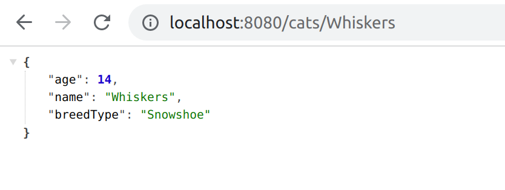
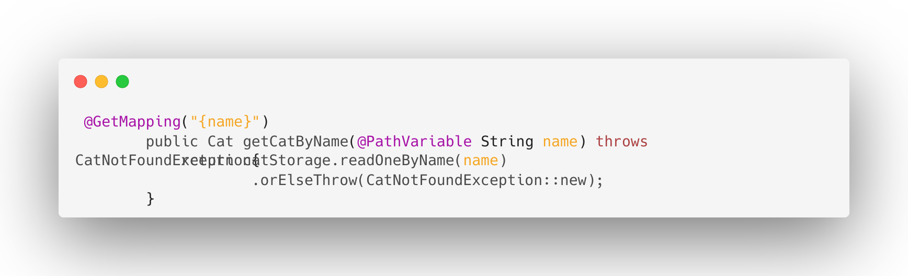

## About
If friendly aliens came to Earth, they would definitely fall in love with cats.
The only problem would be that they wouldn't have them on their home planet. They would surely ask me to help them automate, 
by creating Robo-Cats and populating their planet.
So of course I helped, to bring peace to the universe! 🐾

Technologies included: Spring FrameWork, Java

## How to use it

In the package *endpoint* you will find a class named CatEndpoint .
In this class are all path of endpoints defined for CRUD operations
to create cats, to get a list of cats, to update a cat and to delete a cat (GET,POST,PATCH,DELETE). 

Run the application and Spring will run the server by default on port 8080.
http://localhost:8080/cats

With the method *create*, you can send a cat to the server and the created cat will be added to a list.

You can create your cat with PostMan

Method which sends a cat to the server.

In the service layer there is also a class implemented, which creates cats randomly.

By adding another path of endpoint after *cats* you can request for a specific cat.

In case, there is no cat in the list with requested name, it will be handled by an CatNotFoundException

Go create some cats, edit them and save the universe !

